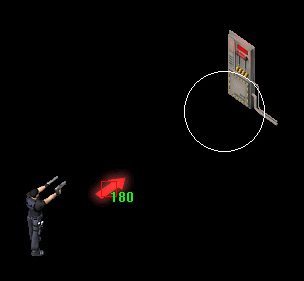
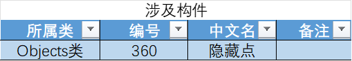
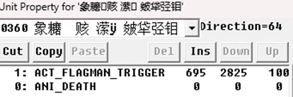
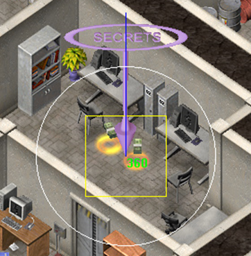
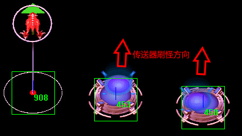
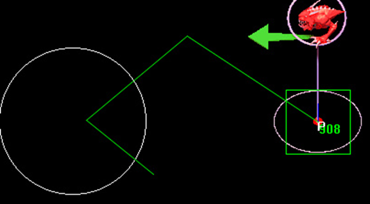
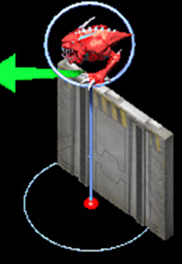

::: info 提示
相信诸位已经了解了所有的编辑器基本操作内容，这一章将讲解一些基本的地图内容修改方面的知识
:::

## 2.1 电闸与电动门

​	一代中的门主要分为可开门和不可开门两种。可开门在电源打开时玩家靠近会自动打开，无需任何脚本和触发。

​	电闸在玩家靠近时会自动将所有可开门状态设置为开，同时切换地图色值到默认，并且将所有红色指示灯切换为绿色。

​	需要注意的是指示灯和电源开闭状态和门开闭状态没有严格关联，一般仅作装饰使用，不会影响任何其余功能。

​	下表为涉及的构件编号

​	还需注意的一点是部分情况下大门会出现被穿透的情况，参见下图。其原理大概是门的堵塞占位符偏离了门原来的位置。将方向设置为==0和64==可以完全避免这个问题，可通过direction边上的按钮来多次切换方向，这样切换出来的方向都是0 32 64 128 等数，可以较快地得到想要的值。

​	两种推荐方向如下,direction分别为==0和64==

## 2.2 可消失的提示箭头

​	默认情况下提示箭头不会在玩家走过一定区域后消失。让其消失需要一定的命令。下面将展示一个可用的案例，在玩家启动电闸后让红色箭头消失。

​	下表为涉及的构件编号，原版所提供的红色箭头只有两个方向。

​	放置完之后按以下操作对其进行属性编辑。

1. 按 ==空格键== 进入编辑模式，然后用鼠标点击选中箭头。此时先不要点击 enter 进入属性编辑界面。将鼠标移到电闸前面，这样就能用 last mouse 功能快速填充圆心坐标。

    

2. ==不要移动鼠标，直接点击 enter==进入属性编辑界面。在命令栈中以此插入 ==ACT_FLAGMAN_TRIGGER==以及==ANI_DEATH==两个指令。

    

3. 选中==ACT_FLAGMAN_TRIGGER== 指令，双击进入其编辑界面。点击左侧的==last mouse==，将鼠标坐标填入var1 var2，即为触发圈的圆心。Var3手动输入，为触发圈半径。然后点击ok保存修改。

    

4. 点击构件属性框中的ok，保存所有修改，然后就能看到编辑器中有一个白圈，这意味着玩家走进白圈所示范围内时将进行触发，箭头消失。白圈大小由var3半径决定，可自行修改。最终效果如下

    

    

## 2.3 隐藏点触发

​	隐藏点触发和消失箭头触发完全一样。如果还不会插入这两行指令或者还不会使用last mouse快速填入圆心坐标，请再看一遍2.2。

​	隐藏点在“死亡”后会自动计入玩家所找到的隐藏点个数。

​	下图所示为隐藏点构件和所用命令

## 2.4 刷怪点

### 2.4.1 三种刷怪点简介

​	刷怪点，用于刷新怪物。常见的两面夹击，完成某项触发后刷怪均能使用刷怪点完成。使用刷怪点还能防止过多叠怪，批量铺设的怪物会导致游戏运行效率下降。游戏中共有三种可供使用的刷怪点。见下表。

​	908是最普通的刷怪点，这个标只会在编辑器中显示，游戏中不会显示。450 453为传送器，其刷怪原理与908一样，区别在于450会自动链接一个800，用于不断刷新小蛤蟆，这个800无法删除，如果删了会自动加回来。453则不会默认刷新怪物，如果不加指令就是一个摆设。

​	800-814均用于以一定速率无限刷新小怪。

​	所有刷怪装置均只能被定时炸弹摧毁。1.2版本的vid为空，1.22版本新增vid图标

​	方向方面，刷出的怪物会按照刷怪点的方向刷出（箭头所示）。450 453仅有一个方向，其和下图所示的刷怪点方向一致（向上方刷出）。

​	在掉落栏选定掉落 1000 则能在每次刷怪时生成一个传送激光

### 2.4.2 刷怪指令

1. 首先，刷怪==必须==要配合 ==ACT_STOP_STACK== 指令。若没写会自动出现在栈顶，这样后续指令就不会运行。所以建议先添加这个指令，然后再将他移植栈底。

2. 插入 ==ACT_FLAGMAN_TRIGGER== 指令，当玩家进入此范围后进行刷怪，不再详细解释。
3. 插入指令 ==ACT_BUILD_UNIT== 用于生成怪物，通常只需填写 var1 以指定生成对象的编号。在这种情况下，当按下插入键（ins）时，标记为蓝色的指令会快速填充所选指令及其参数。如图所示，指令 0 目前被选中，此时点击插入键（ins）将会自动插入指令 ==ACT_BUILD_UNIT 40==，并保留参数 40，从而实现快速生成指令的插入。

4. （可选）可插入 ==ACT_PAUSE== 指令，让刷怪的时候间隔一段时间。

5. 调整指令顺序，将 ==ACT_FLAGMAN_TRIGGER== 移至栈顶，==ACT_STOP_STACK==移至栈尾。

6. 保存当前指令，再在地图上单击右键创建一条行动轨迹。创建的 ==ACT_MOVE== 指令将添加在 ==ACT_STOP_STACK== 后。每一个刷新的怪物都会按照所绘制的路线前进。

7. 最后，所有的指令如下，其意思是玩家进入指定区域后立刻生成3只绿色蜘蛛，然后等待2秒，随后生成2只黄色蜘蛛。每只蜘蛛若没观测到玩家，则都会按照绘制的路线前进。

​	⚠️⚠️注意，生成构件需要有一定的空间才行。若空间不足则将停止生成。如右图，刷怪点边上由于被门遮挡，没有足够的空间生成怪物，当门打开或者消失时生成才会继续。⚠️⚠️

### 2.4.3 无限刷怪

​	在 ==ACT_STOP_STACK== 指令上插入 ==ACT_GOTO_STACK== [所需跳转行] 即可实现无限刷怪。下图所示为跳转到第十行，即紫框所示范围内的指令将会被重复执行。同时所有怪物仍然会按照 ==ACT_MOVE== 所绘制的路线前进。

### 2.4.4 友方刷怪

​	刷出单位的阵营由刷怪点阵营决定。阵营1所刷出的所有怪物都是敌对，反之阵营0所刷出的所有单位都为友军。

​	如下图所示，该刷怪点将生成无人机（默认情况下，无人机为友方单位）。然而，由于刷怪点的阵营设定为1，生成的无人机将变为敌对单位。

​	所以要实现友方刷怪，将阵营设置为==0==即可。同时需要在栈顶插入一条 ==ACT_SET_INVISIBLE [1]== 指令，如果缺少这条指令，刷怪点会在游戏地图中显示出来。下面展示的是一个每隔一段时间无限刷新友方无人机的样例。

### 2.4.5 构件生成器

​	游戏中还提供了一种构建生成器，属于 Terrain 类，编号为 911。它与刷怪点类似，但==无需使用 ACT_STOP_STACK== 指令，同时没有可显示的图标。原版游戏中曾使用过一次，用于生成第十关封死退路的乱石堆。其他区别暂时未知。

​	下图为第十关中的样例使用

## 2.5 墙体触发

### 2.5.1 墙体触发概述

​	有一些特殊的墙体可以进行特性触发，例如被怪物撞开或被炸药炸毁 （618 619）。也存在可以被炸药封死的带窟窿的墙壁（612 616）。

​	下表是特殊墙体涉及的vid。

​	另外需要额外注意墙体的方向，部分方向的墙体（618 619）在触发执行后会有方向旋转的bug。如下图，618在触发后方向0 3 未发生转变；619在触发后方向1 2 未发生转变。

### 2.5.2 怪物 破墙而出 触发

​	==参考战役1 第三关地图。==

​	触发指令如下

+ ==ACT_FLAGMAN_TRIGGER== 指令，其触发半径和圆心坐标和刷挂点触发一样，直接抄一遍即可。
+ ==ANI_DEATH== 指令 使墙壁破碎
+ ==ACT_STOP_STACK== 指令 这行作用未知，官方指令中有些使用了这行。其不是必须的。

### 2.5.2 用炸药炸毁墙壁

==参考战役2 第一关地图。==

这个触发不用添加任何指令，将墙体阵营设置为1即可。

### 2.5.3 用炸药封死刷怪点洞穴

==参考战役1 第四关地图==

​	放置一个带窟窿的墙壁（616或612），然后放一个炸弹安放点，不需要任何指令。炸弹引爆后就会自动生成乱石堆。怎么样，是不是非常简单？😊😊😊

