::: important 参考文献
本文大量参考了 50-鱼鸣嘴 dalao在b站的这篇文章。2和1的编辑器在键位和布局上基本上没有任何差别
孤胆枪手2地图编辑器快速入门教程  作者：50-鱼鸣嘴 https://www.bilibili.com/read/cv16718649/?spm_id_from=333.788.0.0 出处：bilibili
:::

## 1.1 编辑器的安装以及启动

1. 将**MapEditor.exe** 放入游戏文件夹中

2. 双击**MapEditor.exe**，弹出启动菜单。选择参考如下

    + l 驱动选择主显示器驱动程序可，一般也不会有第二个选项

    + l 分辨率共有三个可选选项

        其中1024x768 800x600两个选项可以==完美兼容全屏==。1280x1024则==不能兼容全屏==。这里==推荐1024x768==分辨率，图标和字体看着不大不小，非常舒适。

        

    + l 剩下的选项除了全屏需参考上一条，其他均无需考虑

    + l 准备就绪后电击ok即可启动编辑器

    
    
    ​	⚠️⚠️注意，在进入编辑器前请将输入法切换至英文，快捷键win+空格键。中文输入法可能会造成闪退。若出现白屏闪退的情况，如下图，那说明是输入法的问题。输入法同样会导致游戏也出现这种问题。正常脚本异常是黑屏加载完logo然后闪退⚠️⚠️

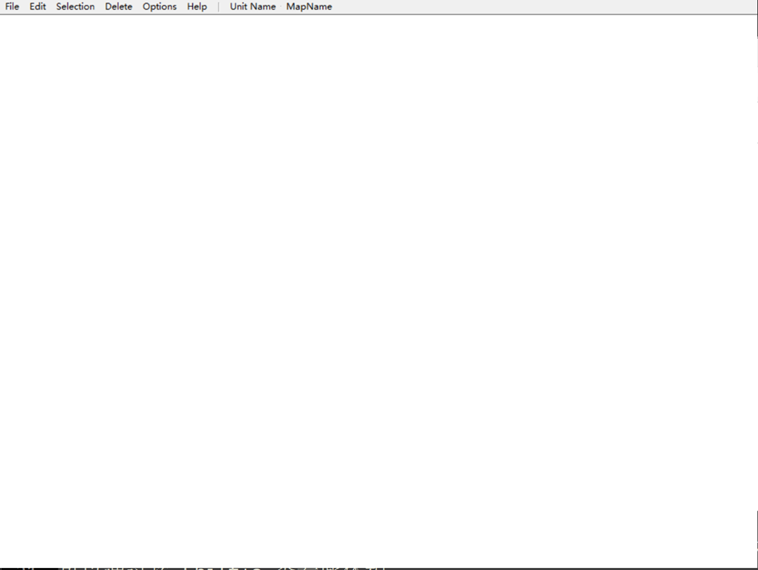

## 1.2 编辑器主界面简介

​	进入编辑器后界面如下。下图是各个板块的简介。本小节接下来的部分将详细讲解各个板块的作用。

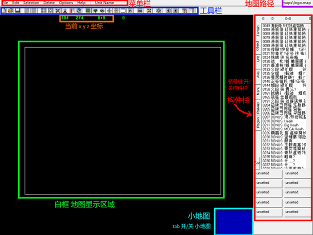

​	注意如果是第一次启动编辑器，主界面会不显示右侧构件栏和小地图。可使用快捷键 =="~"== 开启/关闭构件栏，==“tab”==键开启/关闭小地图。

## 1.3 菜单栏功能简介

​	菜单栏中的功能大部分可以通过快捷键完成，或可以直接通过工具栏进入，总体上说效用不大。其中唯一独有的功能是Selection中的选中全部同类构件。

### 1.3.1 File 栏

​	File栏主要负责打开，保存地图以及关闭编辑器。当前打开的地图会在右上角显示。编辑器==默认会打开logo. map==。所以打开编辑器时==不要直接保存==，可以选择另存为一张新的空白地图 new.map

   下图是file栏的所有操作。其中新建地图的功能不可用。

| *File*   |          |          |
| :------- | :------- | :------- |
| **操作** | **效果** | **备注** |
| New Map  | 新建地图 | 无效     |
| Open     | 打开地图 |          |
| Save     | 保存地图 |          |
| Save as  | 另存为   |          |
| Exit     | 退出     |          |

### 1.3.2 Edit栏

​	Edit栏主要负责放置模式下的构件编辑，包括撤销，填充等

| *Edit*               |                  |          |
| -------------------- | ---------------- | -------- |
| **操作**             | **效果**         | **备注** |
| Undo                 | 撤销             |          |
| Convert Unit         | 转换构件         |          |
| Fill                 | 用该构件填充地图 |          |
| Go to center  map    | 定位到地图中央   |          |
| Go to center  screen | 定位到屏幕中央   |          |
| Go to current Object | 定位到当前构件   | 无效     |

### 1.3.3 Selection 栏

​	该栏主要负责全部选中同种或同类构件。一般用于某种构件批量删除。其中的hide select 功能能全部隐藏某种某件。使用案例将在后续章节提到

| *Selection*            |                        |          |
| ---------------------- | ---------------------- | -------- |
| **操作**               | **效果**               | **备注** |
| Select all             | 选中地图中所有同类构件 |          |
| Select all in  screen  | 选中屏幕中所有同类构件 |          |
| Select all same        | 选中地图中所有相同构件 |          |
| Select same in  screen | 选中屏幕中所有相同构件 |          |
| Go to next  Select     | 定位到下一构件         | 无效     |
| Hide Select            | 隐藏所有同一构件       |          |

### 1.3.4 Delete 栏

​	该栏中的功能均无效，批量删除建议直接用删除模式。删除某一构件建议选中，进入编辑模式后按delete删除。

| *Delete*            |          |          |
| ------------------- | -------- | -------- |
| **操作**            | **效果** | **备注** |
| All Current  Object |          | 均无效   |
| Menu                |          | 均无效   |
| Invisible  Object   |          | 均无效   |
| All Groups          |          | 均无效   |
| Hardware ground     |          | 均无效   |
| GridZ               |          | 均无效   |

### 1.3.5 Options 栏

​		该栏中的map property, option功能可直接通过工具栏按钮进入。这里不多做说明，将在介绍工具栏的章节分别介绍

剩下的操作中rebuild ground会把地图压缩为一个vid文件然后清空地图。其用途不明。注意，该功能除了整活外==慎用==，其清空地图的操作==不可撤销==

| *Options*      |                               |          |
| -------------- | ----------------------------- | -------- |
| **操作**       | **效果**                      | **备注** |
| Map Property   | 打开地图属性                  |          |
| Recale Z grid  | 未知                          |          |
| Rebuild ground | 将地图压缩为vid文件并清空地图 |          |
| Options        | 打开编辑器属性                |          |
| Run time       | 未知                          |          |

## 1.4 工具栏功能简介

### 1.4.1 图标定义及功能

| 图标                                                    | 功能                                                         |
| ------------------------------------------------------- | ------------------------------------------------------------ |
|  | 打开当前地图属性                                             |
|  | 打开新地图                                                   |
|  | 保存为当前地图                                               |
|  | 撤销/重做 上限为5步                                          |
| 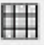 | 网格化自动对齐      用于铺设墙壁                             |
| 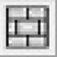 | 窗格化自动对齐     用于铺设地板，天花板                      |
|  | 删除模式，点击即可删除同类构件                               |
| 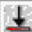 | 自动对齐gao'du                                               |
|  | 喷涂模式     用笔刷批量防止构件                              |
|  | 随即方向放置                                                 |
|  | 切换为terrain类构件     尸体，血迹，地板，天花板等           |
|  | 切换为objects类构件     墙体，装饰等                         |
|  | 切换为unit构件     玩家，敌人，箱子等                        |
|  | 无效                                                         |
|  | 无效                                                         |
|  | 切换为menu类，编辑游戏菜单文件时用到                         |
|  | 未知？疑似是对整组构件下指令？                               |
| 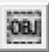 | 进入/退出编辑模式                                            |
|  | 未知？对某一群构件分组，同组将一起进攻和防守？     分组的会划为白线且标有角标 |
| 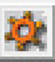 | 进入选定构建属性面板                                         |
| 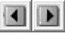 | 切换构件编号                                                 |
|  | 打开编辑器设定栏                                             |
| 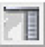 | 开启/关闭右侧构件栏                                          |

### 1.4.2 地图属性编辑

​	点击第一个图标，可以打开地图属性选项卡。                               

​	里面除了地图色值调整，大小调整，==其他均为无效操作==。拉动三个滑块可以立刻更改地图色值，实现灯光效果。然后这个当前色值会以16进制的新式展现在下方文本框中。

​	⚠️⚠️注意，该功能==存在bug==, 色值在调整保存后第二次使用编辑器打开会清空所有设定设置。同时文本框中的色之栏无法输入。这个功能更多在于参考，设置初始色值建议在关卡脚本中使用代码设定，参考后续章节。⚠️⚠️

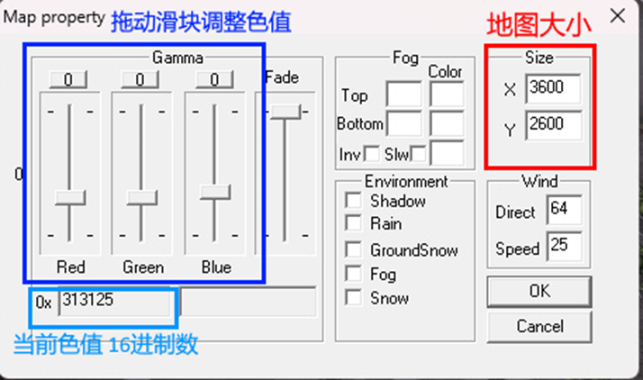

​	该选项卡还可以设定地图大小，地图的延伸方向为==向右==和==向下==延伸。若对地图尺寸没有确切的把握，建议从左上角开始铺，这样可以随时扩充地图。

## 1.5 放置模式

​	在该模式下可以进行放置构件。铺设全部使用这个模式。同时编辑器打开后也会默认使用这个模式。

### 1.5.1 构件以及构件类

​	编辑器中的构件分类如下

- Terrain 地板类，主要包括 大部分尸体，血迹，提示符，激光栅栏
- Objects 物品类，主要包括大部分装饰物，墙体，空气墙，隐藏点，可拾取物品，可使用炮塔，大头尸体
- Unit 单位类，主要包括玩家模型，敌人，箱子，刷怪点
- Menu 菜单类， 主要是各类图标，用于游戏的加载/结算界面，商店等
- Avia, Railway, Region 不知道干啥的

### 1.5.2 构件方向调整

​	某些构件中包含多个方向，它们可能是同一模型不同方向的展示，也可能是不同的相似模型。下图是一个例子，展示了 0413-书柜的12个方向，其中有两个方向为空，一共包含了5中不同种类的书柜。

​	以下是一些可选的更改所放置构件方向的键位。

| *键位：调整方向*              |                      |                              |
| ----------------------------- | -------------------- | ---------------------------- |
| **操作**                      | **功效**             | **备注**                     |
| . 句号键                      | 顺时针旋转放置的对象 |                              |
| , 逗号键                      | 逆时针旋转放置的对象 |                              |
| 数字小键盘                    | 调整构件到指定方向   | 仅在方向<10      时有效 |
| 按住并旋转      鼠标右键 | 调整构建方向         | 不够精准                     |

### 1.5.3 构件高度调整

​	自动对齐高度工具可以使放置构件自动选择高度。屏幕上方三个坐标中z轴坐标会显示 a+b 其中加号前面的是鼠标点击处的高度，加号后面的表示插入构件的高度。下图中的实例展示的32是自动对其高度后电脑的高度，即位于桌面上。

​	自动对齐高度有些时候没那么好用，可用下面键位手动调整高度。

| *键位：调整高度*                |                    |                                             |
| ------------------------------- | ------------------ | ------------------------------------------- |
| **操作**                        | **功效**           | **备注**                                    |
| 数字键                          | 以10为单位调整高度 | 如当输入1时高度为10     当输入0时可清零高度 |
| 鼠标滚轮/     [ ]方括号键       | 以1为单位调整高度  |                                             |
| shift+鼠标滚轮/     [ ]方括号键 | 以90为单位调整高度 | 默认步长为90，     可在设置中调整           |

### 1.5.4 撤销与重做

​	撤销可通过下面快捷键来实现，重做则没有对应的快捷键。撤销和重做上限都为5步

| backspace | 撤销操作 |
| --------- | -------- |

### 1.5.5 快速切换构件

​	每次从构件栏选择所需构件比较麻烦，可尝试使用下面快捷键来快速浏览列表中的构件

| + - 号 | 快速切换构件 |
| ------ | ------------ |

### 1.5.6 批量铺设与自动对齐

​	==按住shift然后拖动鼠标左键==可以批量铺设构件。配合网格或窗格模式能快速地完成墙体以及地板的搭建。如果没有按住shift，拉动鼠标后会以菱形铺设而非方形。

​	自动铺设方面，墙体仅需开启网格模式==（快捷键 s）==开启网格与窗格模式。家具内饰什么的需要因构件而异。

| *键位：批量铺设* |                    |                              |
| ---------------- | ------------------ | ---------------------------- |
| **操作**         | **功效**           | **备注**                     |
| s                | 开启/关闭网格模式  |                              |
| 拖动鼠标左键     | 以菱形批量放置构件 |                              |
| shift+           | 以方形批量放置构件 | 很常用，用铺设设墙壁，地板等 |
| 拖动鼠标左键     |                    |                              |

### 1.5.7 批量删除

​	按住ctrl拉动鼠标左键可批量删除同类的构件，无需进入删除模式。若想删除单个构件，建议在编辑模式下选中然后删除。

| Ctrl+鼠标左键 | 批量删除 |
| ------------- | -------- |

## 1.6 编辑模式

​	在编辑模式下主要进行编辑构件属性的操作。当然也可以选中某一构件对其进行方向，角度，位置上的调整。

​	可以按 空格键 进入或退出编辑模式。

| 空格键 | 进入/退出编辑模式 |
| ------ | ----------------- |

### 1.6.1如何选中构件

​	仅可选中同类构件。

​	当鼠标移动到可选择构件上时，构件会呈现出绿色，此时点击鼠标左键，当构件变红时说明被选中。拖动鼠标左键可以批量选中同类构件。按住alt同时拖动鼠标左键可不规则选择（没啥用）。均参考下图。

​	此时按 ==enter==键可进入编辑构件属性。按 ==del== 可删除所选。按 ==shift+方向键==可移动所选。

### 1.6.2 构件属性面板

​	选中构件后按enter键，构件属性面板如下图。

+   左上角（蓝框）所示为被选中构件编号和名称，下拉右侧小箭头可将其切换为相似构件

+ 左上方（绿框）显示为构件方向，可手动输入指定方向或按箭头调整
+ 右上方(黄框) 显示为构件坐标，下面 last mouse按钮可填入上次鼠标位置的坐标。
+ 右上角army值为构件阵营（紫框）。共有0-3 3个阵营可选
    + 0为友方，即玩家，小地图上为绿点
    + 1为敌方，即怪物，小地图上为红点
    + 2 为中立，一般分配给隐藏点，箱子，油桶，可破坏墙壁，小地图上为黄点或不显示
    + 同为中立，同上，官方地图中未使用
+ 左侧剩余区域为命令栈区，在这里可插入或编辑命令（紫框）。在栈中的命令会==从上至下==依次执行。双击某行指令可进入命令行编辑界面。
    +  Cut copy paste 这三个选项针对所有指令
    + Del Ins Down Up 这四个选项针对单行指令。
+  中间区域所示（红框）为指定掉落，若多选则为在选中的里面随机掉落
+ 右侧behave栏所示为构件行为
    + 一般均勾选aggressive + active 又会移动又会进攻
    + 只勾选 aggressive仅会进攻不会移动
    + 只勾选 active 既不会移动也不会进攻
    + Careful 未知

### 1.6.3 命令行编辑界面

​	双击一个指令即可进入命令行编辑界面。

​	每个指令都会有三个参数。若不填入参数，默认为0。命令行简介参见1.6.4。

​	该界面中的两个 last mouse选项可快速插入上一鼠标位置的坐标进入 var1 var2 或者 var2 var3。

### 1.6.4 命令行简介

​	这一小节的内容结合了export中的俄语注释，实际内容可能与注释中不完全匹配。参数那一栏若没写则表示没有该参数。大部分ANI_指令为调用相关动画，除了ANI_DEATH外其他基本用不上，故不做说明。表格中排序按照编辑器中命令顺序排列。

​	下图为一些编辑器中可显示的命令图例。更多例子会在第二章讨论编辑器具体操作时提到。

## 1.7 隐藏构件功能

​	在地图属性工具栏处可以调整编辑器属性并且隐藏掉某些构件，如隐藏掉天花板，在测试或者探图时还是挺有用的，可以在不删除它们的情况下减少其对地图编辑的干扰。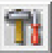                               

​	 编辑器属性面板如下图

​	单击某个构件即可将其隐藏，再次单击可以取消隐藏。此外该界面还可以调整喷涂模式笔刷属性和shift调整高度的步长。

​	至于那个自动保存，信他还不如多敲几次F2呢。

## 1.8 ❗注意保存❗

​	❗❗❗请养成随手按F2保存的好习惯❗❗❗

​	❗❗❗请养成随手按F2保存的好习惯❗❗❗

​	❗❗❗请养成随手按F2保存的好习惯❗❗❗

​	说了三遍，希望你能记住。阁下也不希望搭好的赛博乐高突然啪地以下倒地上了吧。由于种种原因，编辑器闪退还是会不定期发生，且在闪退前几秒是没法保存的，等到屏幕卡死鼠标转圈再按F2就来不及了

​	什么？你说你记不住？没关系，多闪退几次就记住了。🤗🤗🤗

​	普通maps文件无需另存为即可成功保存。Men文件只能另存为才能保存修改。另外另存为选项中还有两个选项，另存为all map file能将整张地图导出为一张很大的tga图片文件。另存为gridz file可以导出地图缩略图（即编辑器里显示的小地图）这俩功能还是蛮有意思的，有兴趣可以自行尝试。

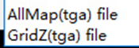

## 1.9 总结 键位操作一览

​	总结一下所有能用到的键位操作。感觉你不看前面的只看这几张表其实也可以。

| *键位  综合*    |                                   |                           |
| --------------- | --------------------------------- | ------------------------- |
| **操作**        | **功效**                          | **备注**                  |
| tab             | 开启/关闭小地图                   |                           |
| ~ (esc下面那个) | 开启/关闭右侧构件栏               |                           |
| 空格键          | 进入/退出编辑模式                 |                           |
| s               | 开启/关闭网格模式                 |                           |
| F3              | 打开地图                          |                           |
| F2              | 保存地图                          |                           |
| Shift+F2        | 另存为                            |                           |
| Alt+F4          | 退出                              |                           |
| c  小写         | 将鼠标移到屏幕中心                |                           |
| C 大写          | 将屏幕移到地图中心                |                           |
| f               | 用当前构件填充地图                |                           |
|                 |                                   |                           |
| *               | 重新定位菜单从 640x480 到 800x600 | 有效性待考证              |
| F7              | 定位到当前构件                    | 有效性待考证              |
| Shift+F7        | 定位到下一构件                    | 有效性待考证              |
| Ctrl+h          | 隐藏构件                          | 有效性待考证              |
| Ctrl+a          | 全选当前构件                      | 有效性待考证              |
| del/ins         | 进入/退出删除模式                 | 进入有效，     但退出无效 |

| *键位：放置模式*                |                      |                                             |
| ------------------------------- | -------------------- | ------------------------------------------- |
| **操作**                        | **功效**             | **备注**                                    |
| backspace                       | 撤销操作             |                                             |
| + - 号                          | 快速切换构件         |                                             |
| 鼠标左键                        | 放置一个构件         |                                             |
| 拖动鼠标左键                    | 以菱形批量放置构件   |                                             |
| shift+     拖动鼠标左键         | 以方形批量放置构件   | 很常用，用铺设设墙壁，地板等                |
| . 句号键                        | 顺时针旋转放置的对象 |                                             |
| ,  逗号键                       | 逆时针旋转放置的对象 |                                             |
| 数字小键盘                      | 调整构件到指定方向   | 仅在方向<10     时有效                      |
| 按住并旋转     鼠标右键         | 调整构建方向         | 不够精准                                    |
| 数字键                          | 以10为单位调整高度   | 如当输入1时高度为10     当输入0时可清零高度 |
| 鼠标滚轮/     [ ]方括号键       | 以1为单位调整高度    |                                             |
| shift+鼠标滚轮/     [ ]方括号键 | 以90为单位调整高度   | 默认步长为90，     可在设置中调整           |
| shift+方向键                    | 移动放置构件位置     |                                             |
| Ctrl+鼠标左键                   | 批量删除             |                                             |

| *键位：编辑模式*                |                                 |          |
| ------------------------------- | ------------------------------- | -------- |
| **操作**                        | **功效**                        | **备注** |
| 鼠标左键                        | 选中该构件                      |          |
| Enter                           | 编辑选中构件属性                |          |
| 鼠标滚轮/     [ ]方括号键       | 以1为单位调整     选中构件高度  |          |
| shift+鼠标滚轮/     [ ]方括号键 | 以90为单位调整     选中构件高度 |          |
| shift+方向键                    | 移动被选中构件位置              |          |
| del                             | 删除被选中构件                  |          |
| 拖动鼠标左键                    | 方形批量选中                    |          |
| alt+     拖动鼠标左键           | 不规则批量选中                  |          |
