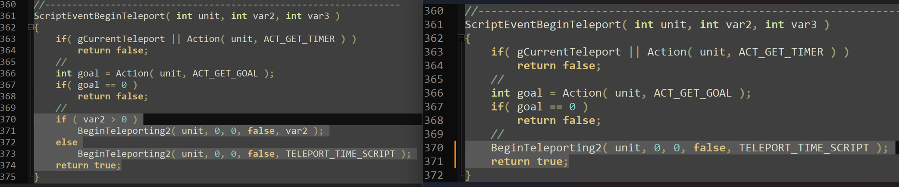

有关传送的代码均在==util_teleport.lgc==中，包括ScriptEvent11 ScriptEvent12 ScriptEvent13的代码

两个版本代码的展示（选中部分），左侧为征兵，右侧为重装/原版。怎么样，看出区别了吧？

征兵中的脚本多了var2 > 0的选项，以此来接受第二个参数，从而达到延时的效果。



想要在重装中也实现这个效果，很简单，直接整个文件替换。

或者把左侧选中的部分复制并替换到右侧。

```c#
	//
    if ( var2 > 0 )
    	BeginTeleporting2( unit, 0, 0, false, var2 );
    else
    	BeginTeleporting2( unit, 0, 0, false, TELEPORT_TIME_SCRIPT );
	return true;
```

# 