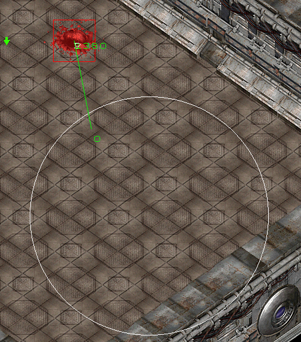
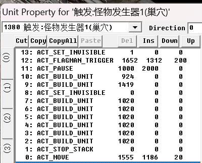
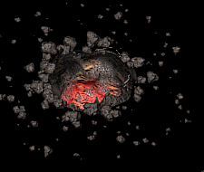
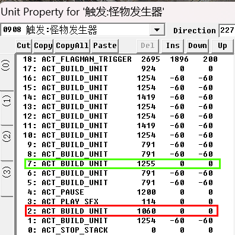
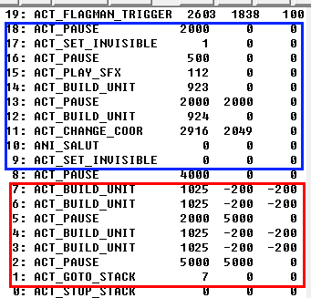

## 小洞穴

==Dummy 类 1380==

另一个vid 1381是纯摆设，没任何作用。



大致原理是将洞穴铺在地图上，先将其隐藏，等到触发达成时再将其取消隐藏，然后配上震动和其他小动画。



```c#
ACT_SET_INVISIBLE 1 0 0
//一开始不显示
ACT_FLAGMAN_TRIGGER 1652 1312 200
//触发区域
ACT_PAUSE 1000 2000 0
//延时1秒+随机上限2秒
ACT_BUILD_UNIT 924 0 0
//动画：地震0.5秒
ACT_BUILD_UNIT 1419 0 0
//动画：生成碎石尘土
ACT_SET_INVISIBLE 0 0 0
//触发后显示
ACT_BUILD_UNIT 1020 0 0
ACT_BUILD_UNIT 1020 0 0
//1020是蜘蛛向上爬的动画，其他怪物没这个动画
ACT_STOP_STACK 0 0 0
//必须有 停栈
ACT_MOVE 1555 1186 20
//每一个怪物进行移动
```

## 大洞穴

需要用 ==Dummy类908== 怪物生成器间接生成。直接放置的大洞穴不具备生成功能，就是个摆设。



用于生成怪物的只有用红框标注出来的，生成一个大头，其余的均为特效，碎石，震动等。可以直接从现有的地图中复制指令，如AS2R第二关。

绿框所示为生成的大洞穴



```c#
924:震动特效;
1254:小烟雾动画;
1419:怪物破洞而出动画;
1255:大洞穴;
791:中等烟雾动画;
SFX 114:破墙音效;
```

## 传送器


原理是从地图的某个角落将事先放好的传送器瞬移到相应位置。指令同样可分为特效区域和真正起作用的刷怪区域。特效指令都是一样的，可以从现成的任务里直接抄。

蓝框所示为特效指令，除了ACT_CHANGE_COOR的坐标，其他无需修改，包括延时指令。

```c#
SFX 112: 地震音效;
923 924: 持续时间不同的地震特效;
ACT_CHANGE_COOR 需要瞬移的坐标;
ANI_SALUT: 从地里钻出来并留下大洞的动画
```




红框所示为刷怪指令，表示从第7行到第1行会不断反复执行。

```c#
ACT_GOTO_STACK 7 跳转到第七行然后反复执行;
```

