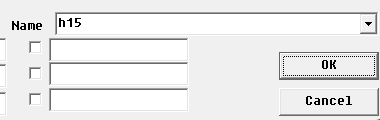
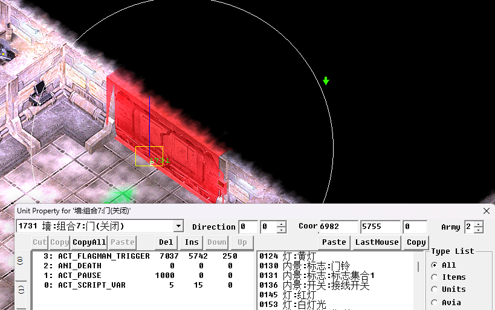
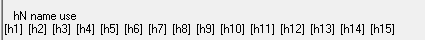
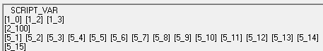

## 地图遮罩

地图遮罩用于遮挡地图的某块区域，当玩家打开门或者触发某个任务后取消迷雾显示地图。所用vid为 ==dummy类的1711和1710==。

这里用AS2R第三关进入基地的部分做例子。这块部分本来是一片黑的，在玩家打开大门后会取消迷雾。


以下为具体步骤：

1. 选中所有区域的1710和1711，将其命名为hN，==这里必须用hN命名==，比如h1,h2,h3...这里官方设置的是h15。

    



2. 对大门做如下命令。其意思是在玩家进入指定区域后开启大门并延时1秒消除迷雾。

    

​	最后一条指令ACT_SCRIPT_VAR用于消除刚才所命名的所有迷雾。

```c#
ACT_SCRIPT_VAR 5 15 0
//变量1 5 用于消除迷雾 无需改变
//变量2 15 用于消除指定迷雾，对应之前命名的h15
```

3. 如果忘了那些编号被用过，可以按下 ==i== 键进入地图信息窗口，可以看到所有被命名过的迷雾以及相应的ACT_SCRIPT_VAR指令。可以看到地图中共定义了15处迷雾且全部都可以被去除。

    



