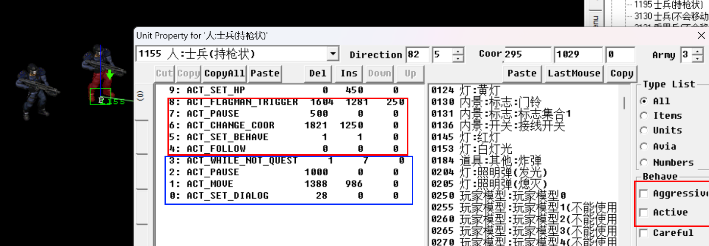

## NPC跟随, 解除跟随, 传送

+ 实现NPC在特定条件下跟随玩家
+ 并在完成某项事件后解出跟随



和传送器瞬移原理相似,将npc放在地图的某个角落,在需要的时候传送过去.

为了放置npc自动跑去找怪,可以选择把aggresive和active取消勾选。在完成传送后用指令将这两个再次勾选。

传送和跟随的脚本如红圈所示。

```c++
5: ACT_SET_BEHAVE 1 1 0 //勾选aggresive和active
4: ACT_FOLLOW 0 0 0 //跟随玩家
```

解除跟随并做其他事的脚本如蓝圈所示。

任务1_7 (击杀所有怪物) 被触发后会自动停止跟随并移动到指定位置