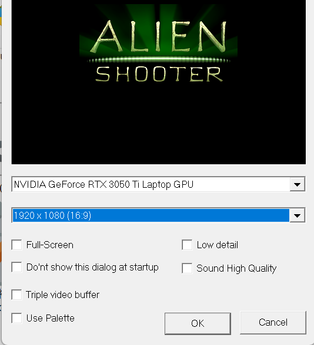

## 启动项

将地图编辑器及其配置文件放进as2或相近版本（编辑器都是通用的）游戏的主文件夹里

在对话框中任选一个你喜欢的分辨率。注意win7及以上版本请勿勾选 ==全屏== 选项

::: tip 画面设置小提示

创建化的时候可能存在UI过小和拖动不方便的问题

可以通过设置屏幕分辨率 `(设置-显示器设置-显示器分辨率)` 的方式让编辑器UI缩放到适合的位置并且占满整个屏幕

我一般作图的时候习惯将分辨率调整至 `1280x720` (大号UI非常适合老年人**🤓**)

:::

## 指令图鉴

指令介绍请前往该界面

[指令图鉴](../../universal/command.md)

## 快捷键

