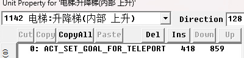
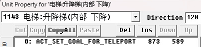

## 升降梯

两个电梯编号 1142和 1143

只需 ==ACT_SET_GOAL_FOR_TELEPORT== 然后打上坐标即可。会自动实现传送动画以及延时。






## 下水道

两个传送点 1112 和 1113

同样只需 ==ACT_SET_GOAL_FOR_TELEPORT==指令即可，动画和延时同理，会一起达成。


## 一般传送

大部分时候用的普通传送。以第一关进入基地的脚本为例。这里只讲进入的脚本，出去的脚本复制粘贴然后改一下左脚即可。==ACT_SET_GOAL_FOR_TELEPORT 13 0 0== 与==ACT_SCRIPT_EVENT==配合使用。


```c#
4: ACT_FLAGMAN_TRIGGER 7471 1945 130
3: ACT_SCRIPT_VAR 1 15 0 //未知，可忽略
2: ACT_SET_GOAL_FOR_TELEPORT 2661 6625 90
1: ACT_SCRIPT_EVENT 13 0 0 //固定组合
0: ACT_GOTO_STACK 4 0 0 //用于反复触发
```

## 延时传送

征兵第三关与将军对话完出电梯时的传送，有一个更加缓慢的过度。仅限于征兵，若要在重装或原版里使用需要稍微修改下代码。代码方面参见后面章节。


```c#
1: ACT_SCRIPT_EVENT 13 5000 0
//第二个参数5000代表延时5秒
//仅在征兵中有效，其他版本第二参数比起作用
```

