## 界面简介

文字部分将涉及到字体，下图是游戏中使用的所有字体编号。对字体的应用一律采用==<Font=xx>==注意F大写。若不写这行会用默认的字体。


进入任务编辑器后界面如图所示。

+ 每个白色的框代表一个任务单元。可双击灰色空白框创建。点击一个创建好的框按下del键可将其删除。
+ 红色的竖线代表关卡分界线。可通过右键单击间隙处创建/取消。可通过最上方的数字条快速跳转到对应关卡。1-0和1-1之间的初始竖线无法被创建，但是必须的，若没有这条线，关卡序列号会乱掉。


进入一个任务框后界面如下

+ begin和fail栏没区别，表示任务被触发的条件和状态。右边四个英文所示的表示任务的状态属性

1. instant complete 立刻完成任务并获取奖励 任务文字会消失 用的非常少
2. complete on next level （存疑）继承任务道具（变量名）到下一关卡
3. unactual on next level  （存疑）在下一关卡开始时清空当前任务文字 这两个常用于支线任务设定，参见AS2R 把香烟给士兵 帮尼古拉找垃圾 等任务
4. Accomplished 任务完成 显示 accomplished 字样
5. win on begin 按空格键通关

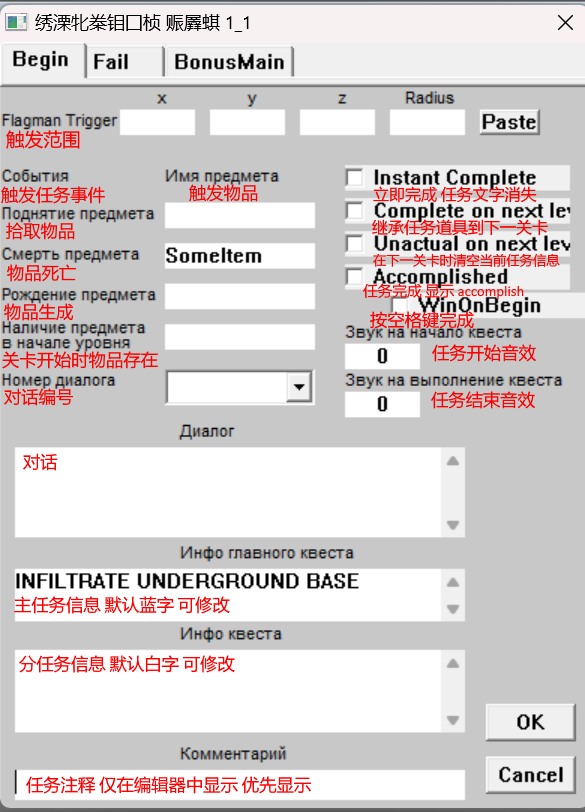

每一个状态栏会在任务框中对应一个小图标，方便识别

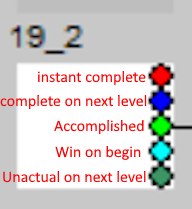

+ bonus main 栏表示任务完成后的奖励以及被回收的物品

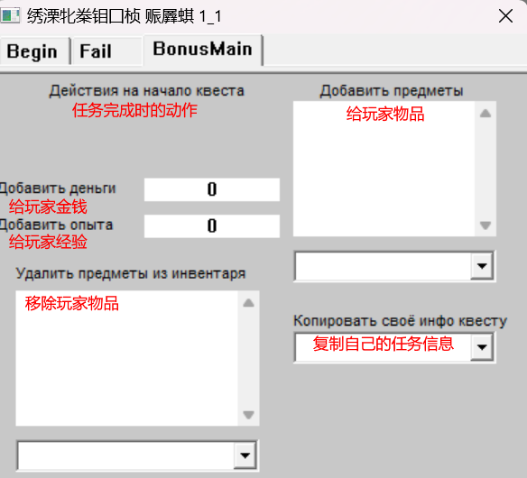

## 实例：一个简单的任务

一个简单的任务：

+ 进入游戏时显示相应主任务信息：根据提示操作 (follow the instruction)

    以及分任务信息：捡起一把武器 (pick up a gun)

+ 拾取武器后触发下一个分任务：击杀一只怪物 (kill a monster)

+ 击杀怪物后显示任务完成信息 并给予玩家金钱和经验奖励。

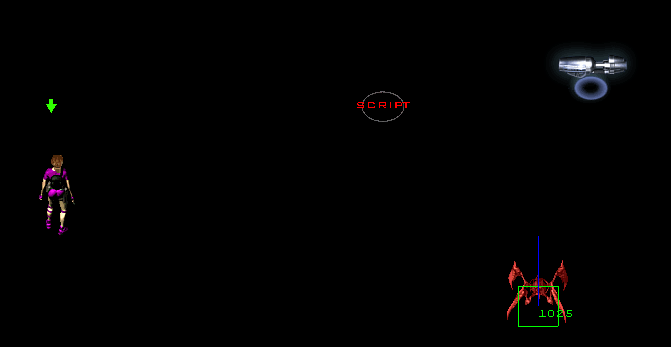

完成这个任务需要三个任务框。

点击==q==可以进入任务编辑器，双击一个空白的框就可以新建一个任务框。之后就可以对这个框进行信息编辑。


对第一个任务的设置如下。


另外需要触发这个任务，需要在地图中放置一个 ==922脚本触发器==，并对其下一条指令。指令变量可通过搜索剧情模式快速填充，也可以手动填充。若缺少这一步，进入游戏后将不显示任务，任务也不会正常进行。


为了达成捡到武器进行下一步的操作，需要给武器添加一个变量名。命名方式以方括号+变量名的形式。==命名必须要加方括号==。这个变量名将用作触发下一任务。比如这里就将武器变量名设置为==[gun]==。

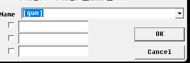

对于任务2的设定，将先前定义的变量名gun填入红框中所示的地方，不用写方括号，意思是当gun从地图上消失时触发这个任务。主任务没必要更新所以可以空着，只填写分任务即可。


任务3用作显示完成任务并按空格键通关。触发条件和拾取武器时相似，为击杀带有特定变量名的怪物后触发。这里将怪物命名为==[monster]==。


任务的触发为monster从地图上消失。另外想要任务胜利，勾选边上的accomplished和winOnBegin可以在任务栏中显示完成的字样同时实现按空格键过关。


最后，在任务3的BonusMain一栏中可以添加奖励。下图所示为奖励金钱和经验各10000。


## 实例：杀光怪物后开门

类似于AS2R第6关链接传送器的那个房间

+ 进入某个房间后关闭大门，摧毁所有怪物或传送器后再次打开大门。

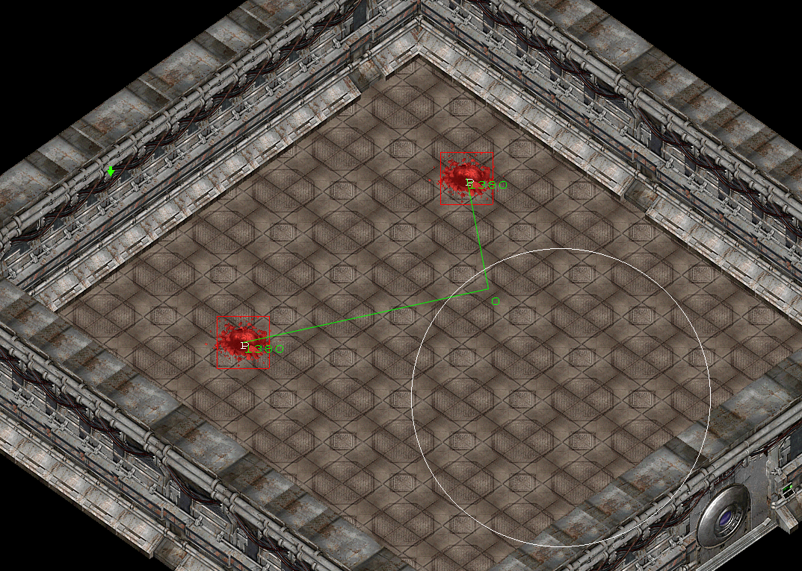

==**第一步**== 需要对大门进行如下操作。注意勾选 ==Inherit Stack at death== （死亡后继续执行触发）这个选项，这样门就能做到反复开闭。这里的 quest 1-6 用于表示杀光怪物后执行的任务。

```C
ACT_WHILE_NOT_QUEST 1 6 0
//击杀完所有怪物后再次开门
```

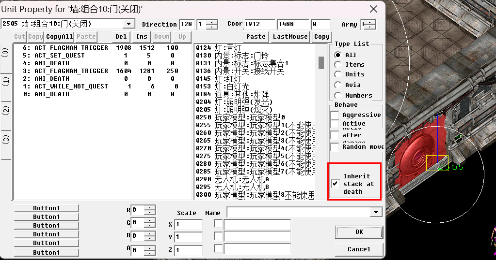

==**第二步**== 以==mN== (m1 m2 m3.....)格式命名怪物洞穴，支持将多个洞穴/刷怪点/传送器 同时命名为同一个变量 (比如上图扔了两个洞穴，为了达到效果，将其均名为为m1)。这里所展示的是杀死所有刷出的怪物，传送器命名和第16关摧毁所有异形蛋的设置同理。

和一般刷怪点不一样，这里多了一行 ==ANI_DEATH== 用于所有怪物生成后使其死亡然后触发所需任务


```c#
ANI_DEATH 0 0 0
//所有怪物生成后使其死亡
```

==**第三步**== 任务编辑器中设定为m1从地图上消失后触发。（1-6）

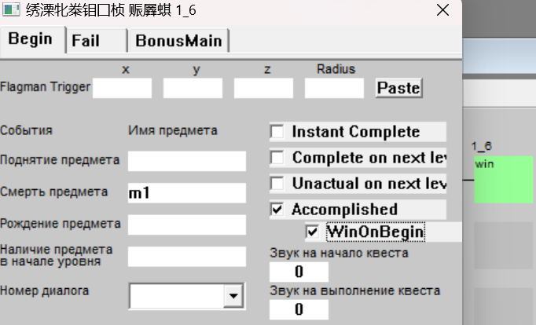

## 实例：拾取钥匙后开门

类似AS2R第二关需要捡到特定钥匙才能打开的门。

+ 捡到钥匙才能开门, 同时消除对应战争迷雾, 收回钥匙
+ 没有钥匙不开门，同时显示“访问遭拒”的文字
+ 指示灯随门的状态变化

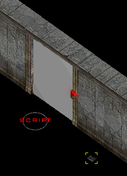

==**第一步**== 放一个门禁卡，编号为 objects-1638，方向选择为2


对其进行命名，格式如下。Obj_personalkey是物品名，拾取后给玩家一张灰色的钥匙卡，通过下拉菜单选择。如果选择其他的物品名则给一张其他的钥匙卡。[key]是用于触发任务的变量名，可以随便自定义。

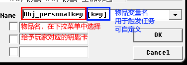

==**第二步**== 设置两个任务。这里将其设置为2-1和2-2。

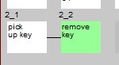

2-1用于判定是否捡到卡片，在触发栏第一栏拾取触发中填入刚才设定的变量名[key]。

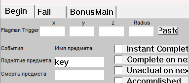

2-2用于在开门后回收玩家的钥匙，在BonusMain一栏中如下位置填入物品名Obj_personalkey

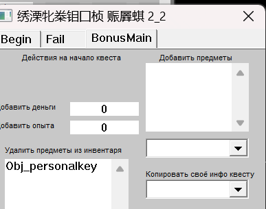

==**第三步**== 放置一个922脚本触发器。用于显示“访问遭拒”的信息提示。这里需要用到两个栈区。

栈区0用于显示信息，脚本如下


栈区1用于销毁该触发器，玩家拾取钥匙后，即任务2-1被触发，不再显示文本。脚本如下


==**第四步**== 对门进行触发，脚本如下。开门后消除区域遮挡同时触发任务2-2 （红框所示）用于回收玩家钥匙。

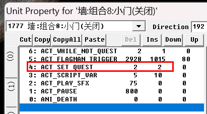

==**第五步**== 对指示灯进行触发，脚本如下。玩家拾取钥匙后，由红色切换为绿色

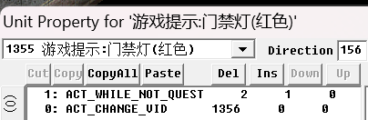

## 实例：安放炸药

使用炸药炸毁特定设施 比如中央处理器，大门

+ 捡到炸药后才能触发安放炸药动画

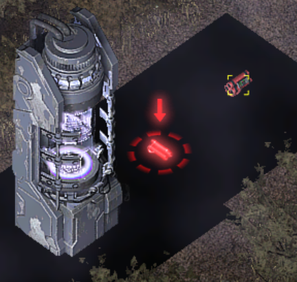

==第一步== 设置一个任务框，用于检测玩家是否捡到炸药，这里设置的是3_14。

触发条件是捡到炸药。这里将炸药命名为boomb，触发条件填写在第一栏（拾取）


==第二步== 对1360炸药安放处进行写如下脚本


``` c++
3: ACT_WHILE_NOT_QUEST 3 14 0 //任务触发 失去炸药后
2: ACT_FLAGMAN_TRIGGER 4687 3949 40 //安放炸弹范围
1: ACT_BUILD_UNIT 770 0 0 //创造起爆前的炸药
0: ACT_DESTROY_UNIT -1 0 0 //销毁 安放点
```

==第三步== 对需要被摧毁的构件进行如下脚本设置。触发范围同上，延时 ==4200== 毫秒为固定炸药起爆时间

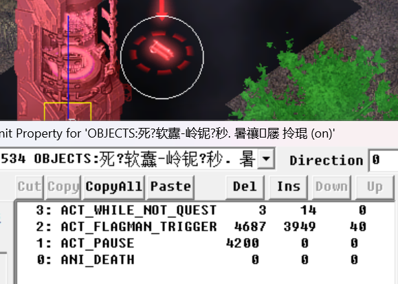

## 实例：继承道具至下一关

道具图标会一直被继承，但道具名默认不会被继承。

以2-4关拾取香烟为例。

==第一步==，在第二关有一个叫[cigar]的东西

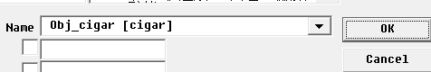

==第二步== 任务编辑器中做如下设置3-1,3-2在第二关,3-7,3-3,3-4在第三关

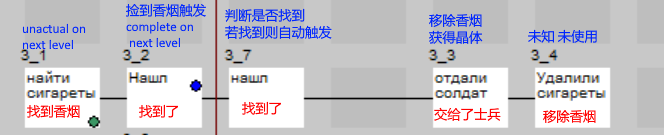

==第三步== 地图内命令设置

1. 放置一个脚本触发器，将任务设置为3-1。这个用于判断香烟是否存在（是否被捡到）如果未持有香烟，则任务状态会在3-1，若持有香烟，任务状态更新至3-7，可与士兵发生对话

    

2. 第四关的设置同理