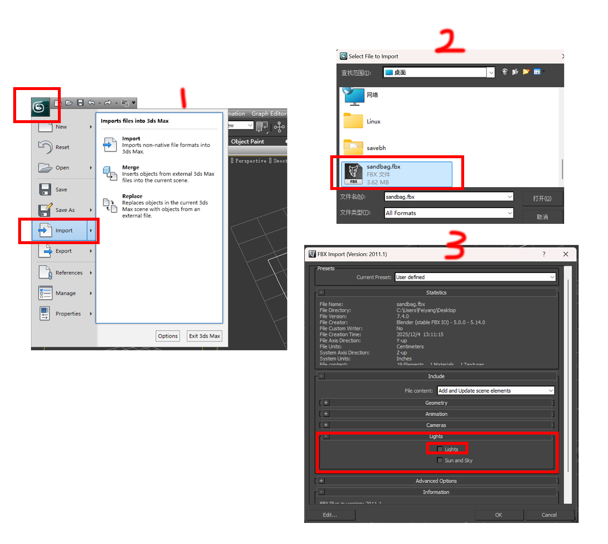
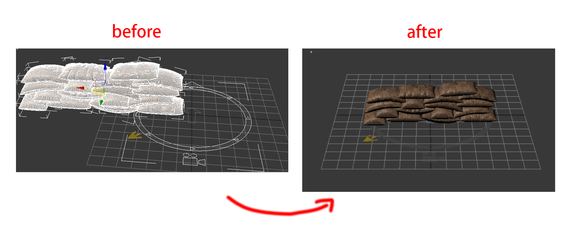
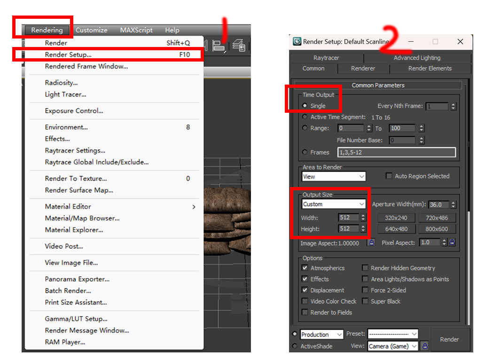
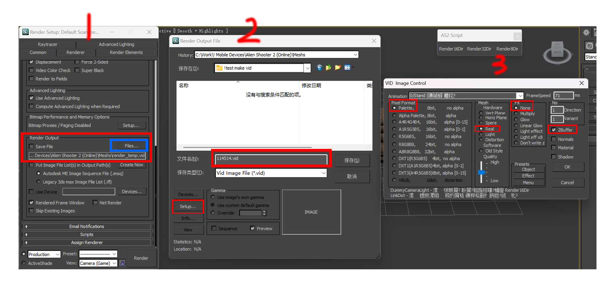
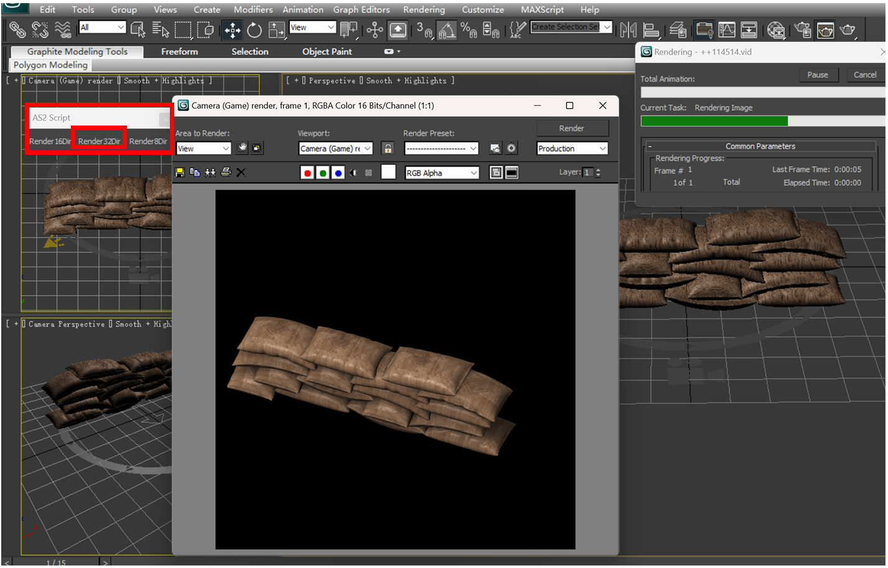
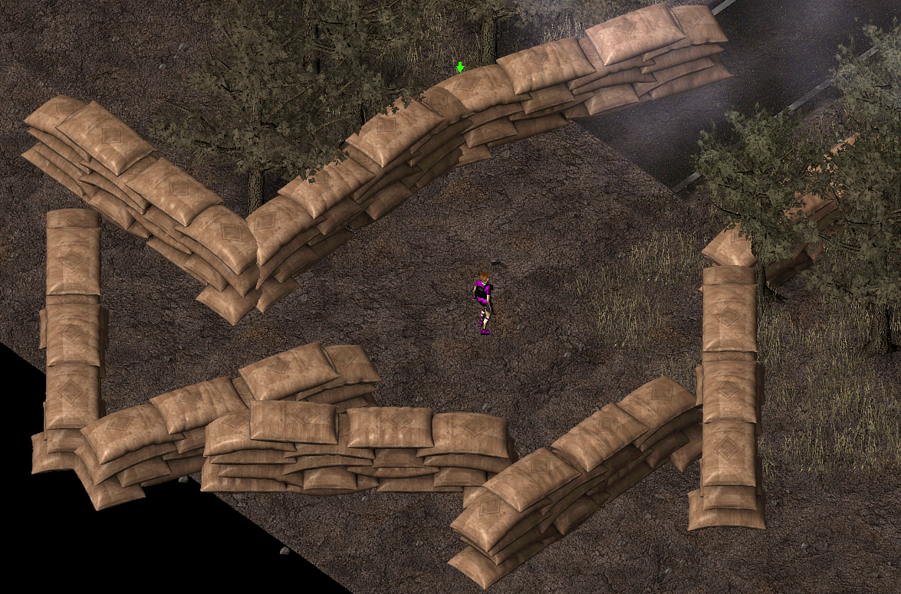

一般选择从外部导入3d模型，选择fbx格式，他自带贴图且兼容性不错。需要注意最新版格式的fbx可能无法兼容2011版，一般选择fbx2011或fbx2014。blender导出的fbx就能完美兼容。

素材都放在example文件夹里了,不用你再去网上找模型🤓

## 键位操作

::: tip 3ds Max 中一些简单的操作

+ F4 开启/关闭 线框模式
+ 鼠标中键 移动画布
+ ALT+鼠标中键 旋转画布 （等同于拖拽右上角立方体）
+ 滚轮 缩放

+ W 移动
    + F5 锁定X轴
    + F6 锁定Y轴
    + F7 锁定Z轴

+ R 缩放 
    + 点击里面的黄色三角体可以实现等比缩放
+ X 关闭/开启 三色坐标轴 (这个功能没什么用 放在这里是防止出现误触导致坐标轴消失)

+ F10 开启render选项框
+ P 开启透视视图

:::

## 导入模型并渲染为VID

点击最左上角的logo图标，选import, 即可打开导入界面。

导入设置界面中请注意将==Lights==选项中的==Lights==取消勾选。这个条目默认是折叠起来的，需要手动展开。

导入后模型可能不会刚好位于中心点，需要进行缩放和调整（快捷键见上），最终模型大小最好在底部的圆圈内。

如果打开来是一堆白色的网格可通过F4开启/关闭网格视图。

如果觉得当前视角看着不舒服可以选择==P==键打开透视视图

下一步开始render渲染==(快捷键F10)==

点击工具栏中的==Render== - ==Render Setup==, 

在弹出来的对话框中将 ==Timeout==勾选为==Single==（因为这是静态模型，只有1帧）

​				将==Output Size==设置为==512x512== (看情况设置)

还是在这个对话框中，往下拉，找到==render Output==条目，点击蓝色框中的==files==按钮。

之后会弹出来一个新的对话框，在这里可以自定义vid文件文件名，点击该对话框中的==SetUp==按钮。

然后会弹出第三个对话框，在此处的每一个栏目中分别勾选 ==Palette==, ==Real==, ==None==, ==ZBuffer==. 最后点击ok和保存

最后，点击最开始创建的toolbar中的方向按钮，想要创建多少个方向的vid取决于你的意愿。8dir就代表这个vid会有8个不同的朝向，16和32都以此类推

然后等他的进度条跑完就行了，可能需要花一段时间。

## 编辑res并导入游戏

最后一步：将vid导入进object.res。本文不会具体讲述res文件，如有需要请参见res文件相关教程(当然我目前还没写)。

直接从一个相似的构件中抄一份改一下，我选的是1701基地墙壁。

修改NVid, Name, NoDir, VidName等参数。 SizeXYZ理论上也要改，但我不知道他的具体参数。不改也没关系，引擎会优先使用vid参数进行设置而非res中的定义

可以看到在编辑器/游戏里vid也能完全正常使用

