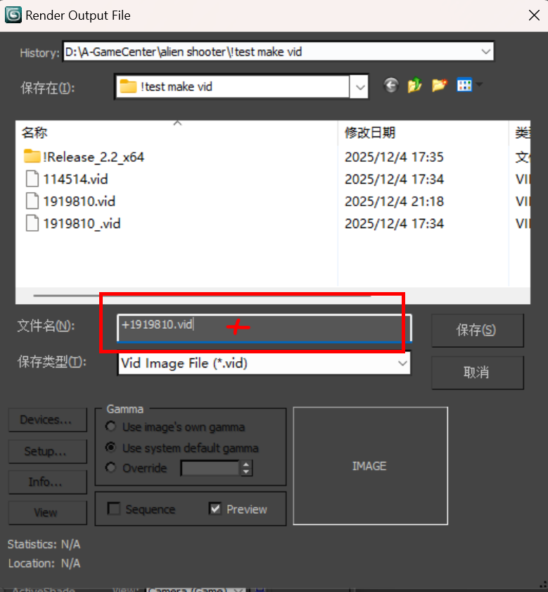
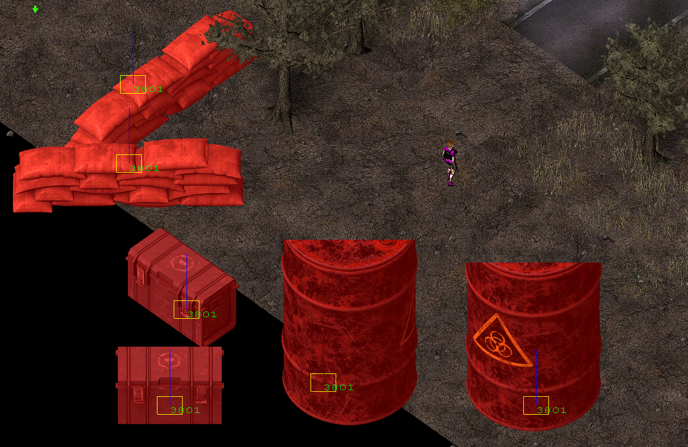

在游戏中你可以看到一组相似的物体公用一个vid编号,比如所有计算机都在nvid=114(假设)中.

本节将讲述如何把多个不同的3d模型压制到一个vid里.

## 导入模型并渲染为VID

创建单一vid的步骤将跳过,因为和上一章节讲的完全一样,直接快进到rendering第二个模型的步骤

请注意两份模型的width和hight必须相同，之前设置的是512x512, 这个也得设置为512x512, 不然会一直报错, 关都关不掉的那种, 很烦

在设置vid文件名的时候，在已有vid名的最前面写一个+号，比如第一个vid名字为1919810，此次导出则为+1919810

如果有多分模型需要处理则一直重复上述步骤，每次都讲文件保存为+1919810

在经历完所有render后,可以在目标文件夹下看到数个以1919810开头的vid文件.由于我导入了3个模型 (依次为沙袋,武器箱,油桶), 所以他也会有3个不同的vid. 从上到下三个以此为: 

+ 我们需要的,包含3个不同的模型
+ 包含第一个沙袋模型
+ 包含第一个沙袋和第二个武器箱模型

## 编辑res并导入游戏

对res进行如此设置, 我对三个模型的dir设置为16+8+8, 所以NoDir应该填32

可以在编辑器和游戏里查看到3个不同的模型, 他们都属于nvid=3801

其实在设置大小的时候失误了, 对模型太没概念了, 但是我懒得改了, 就这样吧, 后续有空更新一下模型对照数据.

