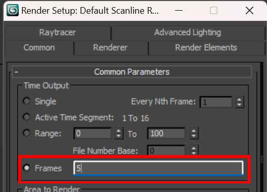
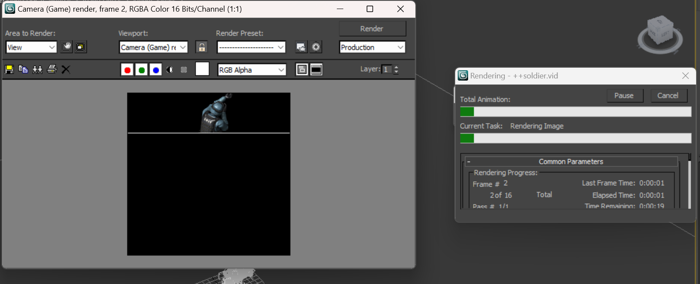
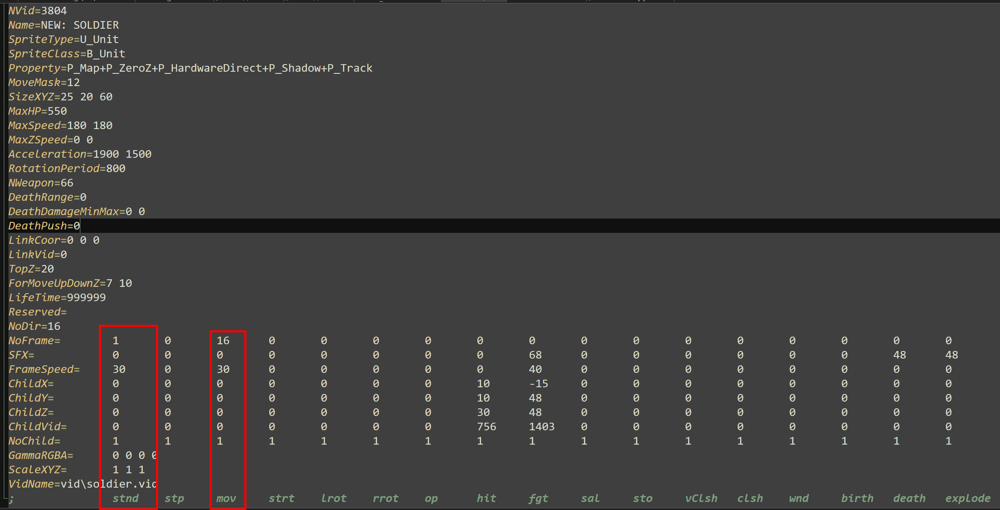

现在将开始制作动态模型。以士兵模型距离，模型本体会包括待机（站立），移动，射击三个不同的部分（子模型可能有其他的，可以参考object.ini中的定义），而这三个都需要包含在一个.vid文件中。模型用的是从 adobe mixamo 中下载的样例模型。

下载的模型最好是原地踏步的（in place）否则渲染的时候模型很可能会跑到渲染窗口外头去。

## 键位操作

::: tip 3ds Max 中一些动画的操作

1. 核心播放控制

- **播放/停止动画：** `/` (正斜杠)。
- **停止播放：** `Esc` 或 `/`。
- **跳转到起始帧 (Start)：** `Home`。
- **跳转到结束帧 (End)：** `End`。

------

2. 逐帧/关键帧导航

- **向前移动一帧：** `.` (句号)。
- **向后移动一帧：** `,` (逗号)。
- **移动到上一个关键帧：** `Shift` + `,` (逗号)。
- **移动到下一个关键帧：** `Shift` + `.` (句号)。

:::

## 第一步-创建stand模型 (待机动画)

重复实例1中的教程，将这个模型的第一帧作为基准待机模型。

将其导出为16方向，这意味着已经有了16个方向的待机模型。

如果你不想以第一帧进行渲染，可以在render窗口中自定义一个渲染帧

## 第二步-创建行走模型

在render界面将选项设置为 Active Time Segement

文件设置中记得在文件名前面加上+号，就像实例2中所解释的那样

渲染的过程会比较漫长，依然选择16个方向。这样你会得到16个方向的模型，每个方向都有走路的动作

## 第三步-配置RES并导入游戏

从士兵的ini中抄了一份配置过来。

必须要修改的部分是对应动画的NoFrame，在导出的过程中stand动画用了1帧，故填1；move动画用了16帧，故填16. 这一步必须严格按照导出模型来，负责将会出现帧错位等情况。

下一栏 NoFrame不是很重要，最好还是按照模型原有的帧数填

