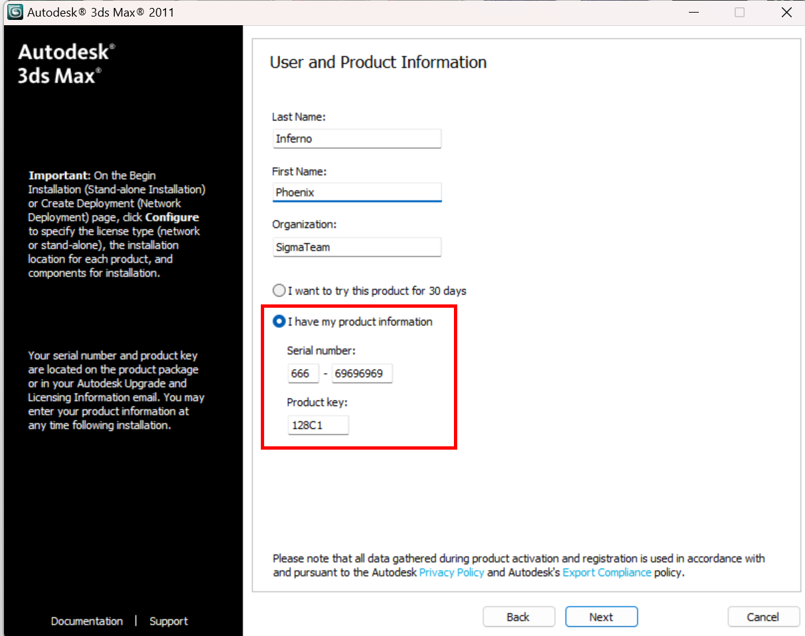
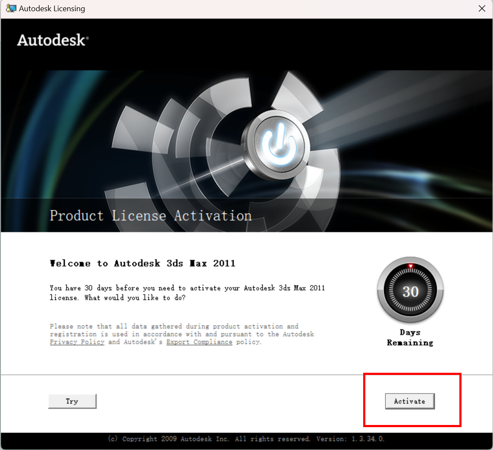
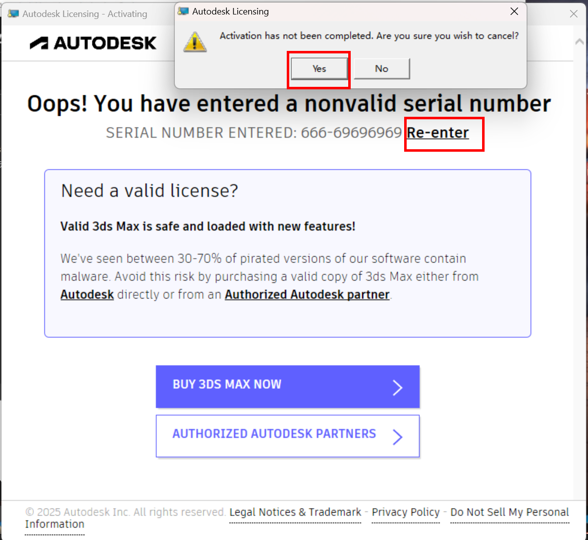
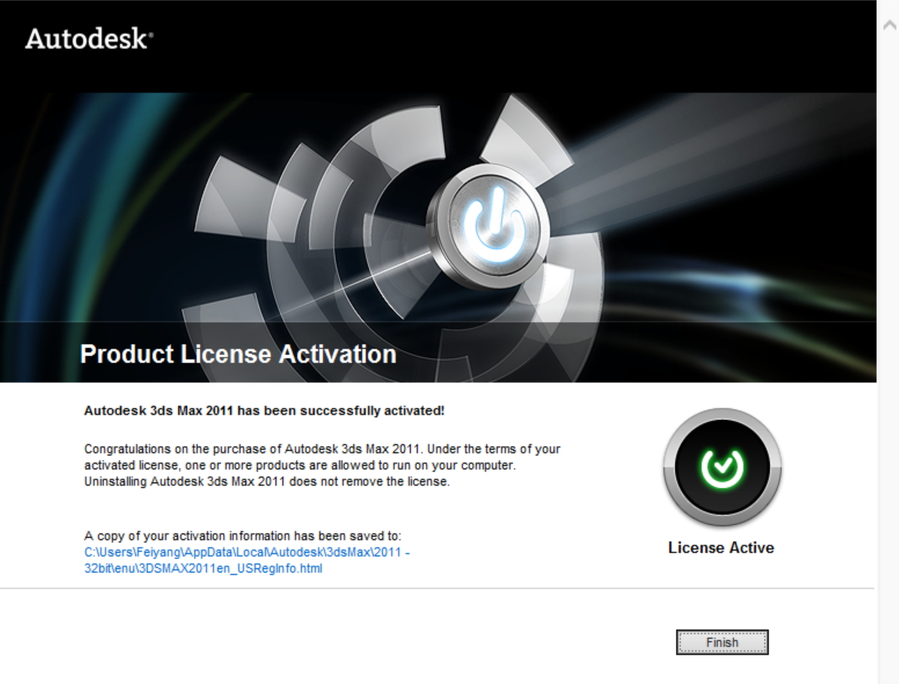
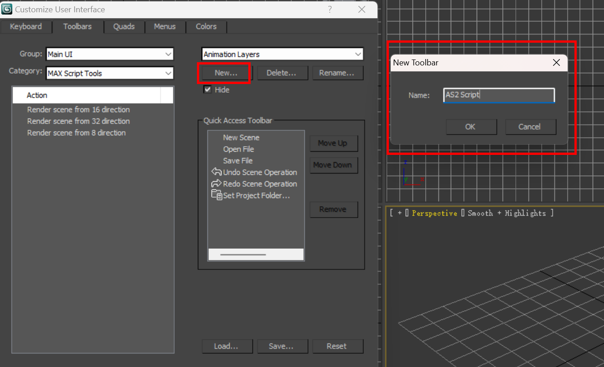
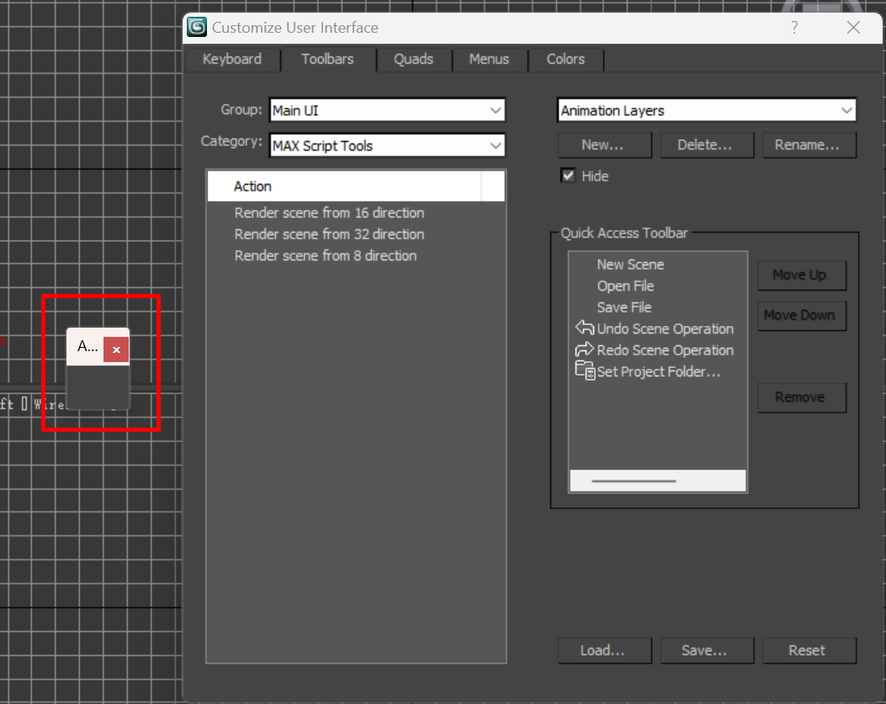
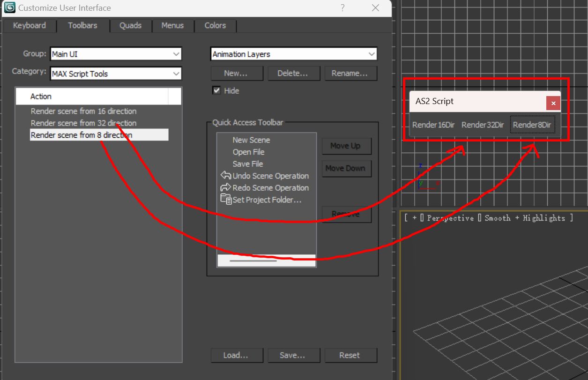
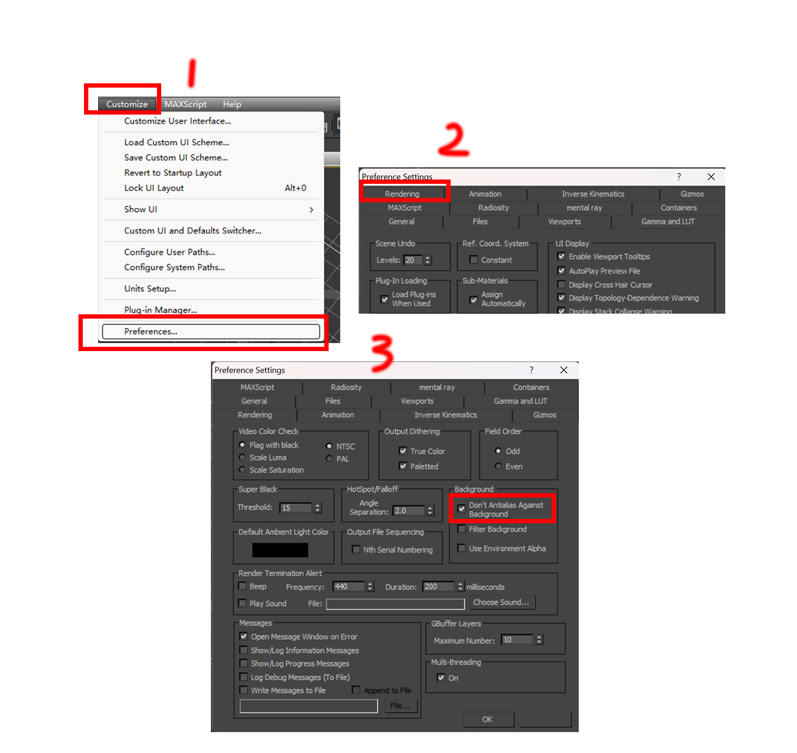

## 安装 3ds Max 2011 32-bit

解压素材包，进入 Autodesk 路径，双击 `Setup.exe`。


选择第一个选项 **Install Products**。


勾选安装 **Autodesk 3ds Max 2011 32-bit**。

只需勾选第一个，剩余组件会默认选中。

::: warning  注意
Composite 是用于后期合成的，无需安装。VID 制作插件仅适用于 32-bit 版本，因此 64 位版本也无需安装。
:::


在下一界面同意许可协议。

**Product Information（产品信息）界面**

First name、Last name 和 Organization 可以随意填写。

**请务必完全按照下图及以下信息填写：**

选择 **I have my product information**

::: important
Serial Number: ==666-69696969==
Product Key: ==128C1==
:::



在此界面点击 **Configure** 选项可以自定义安装路径。


配置完成后，点击 **Install** 即可开始安装。


## 激活 3ds Max 2011

双击桌面上3ds Max的图标，点击Activate



如果在激活过程中弹出以下警告，直接无视，点击是。如果弹窗没有消失，一直点是直到消失为止。


选择 Re-enter，之后的弹窗选Yes



然后会来到这个界面，此时，需要用到注册机破解程序。


解压Crack压缩包，得到 xf-a2011-32bits.exe

先点 Mem Patch

把激活界面的Request输入进去，点击Generate会获得激活码


将生成的激活码填写到激活界面中即可完成激活




## 界面缩放问题

如果你的电脑分辨率高，会导致整个软件的UI图标和字体都变得十分地小，有两种办法可以修改这个问题。

1. 去设置里降低屏幕分辨率。

2. 进行兼容性设置。

    右键exe - 属性 - 兼容性 - 更改高DPI设置 - 替代高DPI缩放行为 -- 系统


## 安装vid插件

找到压缩包中的Plugins文件夹，将plugins, scenes, ui三个文件夹复制到之前安装的3ds Max根路径下。


三个文件夹中的文件如下所示

``` bash
Plugins
    │
    ├─plugins
    │      vid.bmi
    │      vid.txt
    │
    ├─scenes
    │      empty_vid.max
    │
    └─ui
        └─macroscripts
                wit16dir.mcr
                wit32dir.mcr
                wit8dir.mcr
```

安装完之后重新打开3ds Max界面

我们需要来来创建一个toolbar

依次点击上方工具栏中的 Customize - Customize User Interface - toolbar

在Category中选择MAX Script Tools, 这样就能在下方列表中看到刚刚导入的三个mcr文件


点击面板中的new，创建一个新的toolbar. 名字可以随便取.



点击ok之后会有一个小框出现在屏幕左侧



把三个脚本依次拖进去



这样插件和toolbar就配置好了。

下次再打开3ds max后这个toolbar也会自动打开，如果不小心把它关掉了，可以再回到这个界面，在右侧栏中找到AS2 Script (或是你自定义的名字), 把hide取消勾选。


## 设置empty_vid场景以及配置

每个 vid 的制作都需要基于 ==empty_vid.max== 场景文件完成。该文件预设了视角、相机位置、光照等场景参数。

将文件拖入 3ds Max 后，即可看到以指定视角（俯视斜 45°）展示的场景。在此场景中编辑 3D 对象，导出的 vid 将保持相同的俯视斜 45°角度。

简单讲一下这个场景的配置。点击工具栏中的 Manager Layers 图标可以打开图层管理。蓝色框中的立方体图标是用来调整视角的，拖动鼠标滚轮可以缩放整个画布。


::: info 原理讲解
🤓☝剩下这部分是官方人员教程里写的，我搬运翻译了一下，其实不看似乎也不影响后续制作🤓☝


摄像机和灯光被隐藏在隐藏图层中


摄像机和灯光已链接（绑定）到 "DummyCameraLight"，通过旋转它，可以从不同角度导出对象。

还有很重要的一点：如果缺少 "DummyCameraLight" 这个对象，用于导出方向（多角度）的脚本将无法工作！

:::

之后，还需要在工具栏 Customize - Preferences - Rendering 中勾选 ==Don't Antialias Against Background==选项



在 Alien Shooter 2 引擎中使用了 2 种类型的构件 (Spirit)

1. 伪 3D, 除了特效以外的所有物体
2. 带透明度的平面 Sprite（特效）

下一章节开始将从简单的例子开始示范如何制作vid。